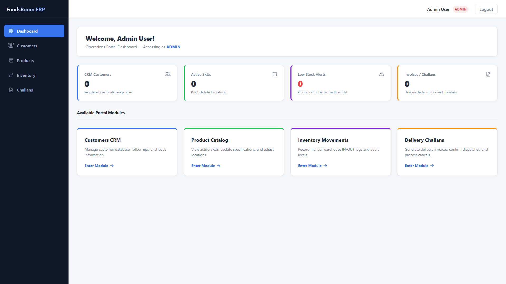
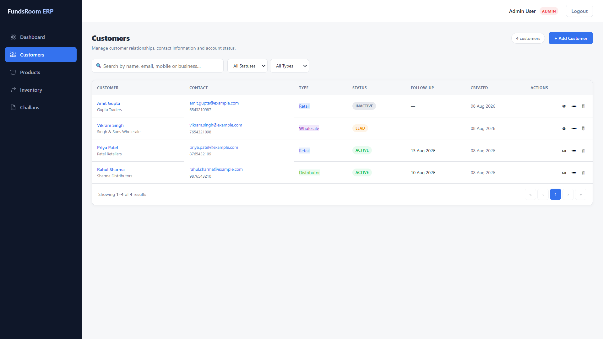
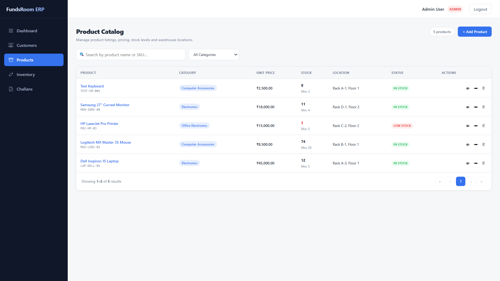
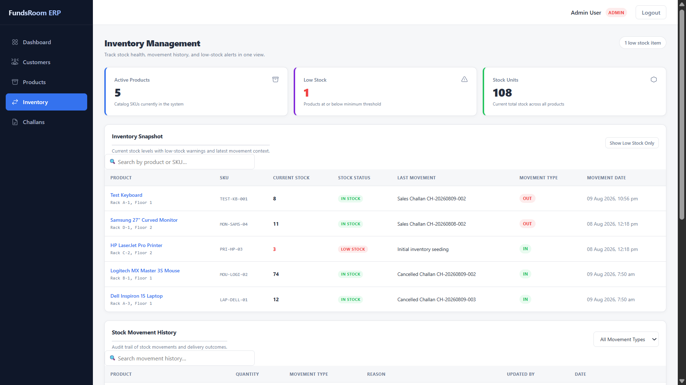
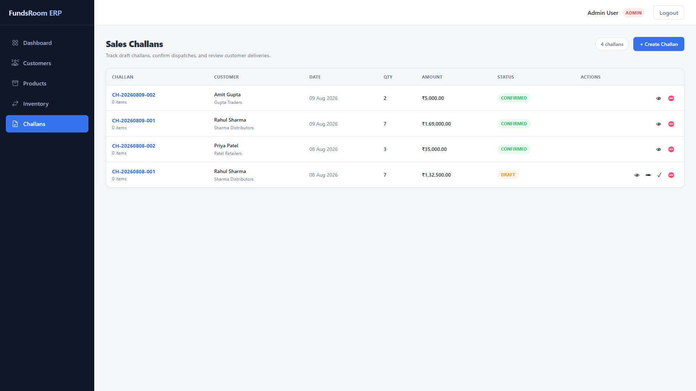

# FundsRoom Mini ERP / CRM Operations Portal

A full-stack **ERP + CRM Operations Portal** built for campus placement evaluation.

The application provides role-based access to customer management, product catalog, inventory tracking, and sales challan operations.

---

## 🌐 Live Demo

### Live Application

https://fundsroom-mini-erp-drab.vercel.app/

### Demo Login Credentials

| Role | Email | Password |
|------|-------|----------|
| Admin | admin@example.com | admin123 |
| Sales | sales@example.com | sales123 |
| Warehouse | warehouse@example.com | warehouse123 |
| Accounts | accounts@example.com | accounts123 |

> Use the demo accounts above to explore the role-based access and application modules.

---

## ✨ Key Features

- 🔐 JWT-based authentication
- 👥 Role-Based Access Control (RBAC)
- 📊 Operations dashboard with live metrics
- 👤 Customer CRM management
- 📦 Product catalog management
- 📈 Inventory monitoring and stock tracking
- ⚠️ Low-stock alerts
- 🔄 Stock movement history
- 🚚 Sales / Delivery Challan management
- 📝 Create and manage challans
- 🔄 Challan status lifecycle
- 💾 PostgreSQL database using Supabase
- 🧩 Prisma ORM for database access
- 🛡️ Zod validation for backend APIs
- ⚡ React + TypeScript frontend
- 🚀 Vercel deployment

---

## 📸 Application Screenshots

### Dashboard

The dashboard provides an overview of CRM customers, active products, low-stock alerts, invoices/challans, and available portal modules.



---

### Customers CRM

The Customers module provides customer records with contact information, customer type, account status, follow-up information, search, filtering, and CRUD operations.



---

### Product Catalog

The Product Catalog allows users to manage products, categories, pricing, stock levels, warehouse locations, and stock status.



---

### Inventory Management

The Inventory module provides current stock visibility, low-stock alerts, stock movement information, movement types, and movement history.



---

### Sales Challans

The Sales Challans module allows authorized users to create and manage challans, review customer deliveries, and handle challan status transitions.



---
## 📋 Tech Stack

| Layer | Technology |
|------|------------|
| Backend | Node.js, TypeScript, Express.js |
| Database | PostgreSQL via Supabase |
| ORM | Prisma |
| Frontend | React 19, TypeScript, Vite |
| Authentication | JWT (`jsonwebtoken`) |
| Validation | Zod (backend), native validation (frontend) |
| API Communication | REST APIs |
| Deployment | Vercel |
| Version Control | Git & GitHub |

---

## 🏗️ System Architecture

```text
┌──────────────────────────────────────────────┐
│              React Frontend                  │
│         React + TypeScript + Vite            │
└──────────────────────┬───────────────────────┘
                       │
                       │ REST API
                       ▼
┌──────────────────────────────────────────────┐
│              Express Backend                 │
│     Controllers → Services → Routes          │
│          JWT Authentication + RBAC            │
└──────────────────────┬───────────────────────┘
                       │
                       │ Prisma ORM
                       ▼
┌──────────────────────────────────────────────┐
│          PostgreSQL Database                 │
│              Supabase                       │
└──────────────────────────────────────────────┘

🗂️ Project Structure

fundsroom-mini-erp/
│
├── server/
│   ├── prisma/
│   │   ├── schema.prisma          # Database schema
│   │   ├── seed.ts                # Demo data seeder
│   │   └── migrations/            # Prisma migrations
│   │
│   ├── src/
│   │   ├── app.ts                 # Express app configuration
│   │   ├── server.ts              # Backend entry point
│   │   ├── controllers/           # Request handlers
│   │   ├── services/              # Business logic
│   │   ├── routes/                # Express API routes
│   │   ├── middleware/            # Authentication & RBAC guards
│   │   ├── validators/            # Zod validation schemas
│   │   ├── types/                 # TypeScript type definitions
│   │   └── utils/                 # Utility & error classes
│   │
│   ├── scratch/
│   │   └── test_challans.ts       # Challan integration testing
│   │
│   ├── .env                       # Local configuration
│   └── .env.example               # Environment reference
│
├── client/
│   ├── src/
│   │   ├── components/
│   │   │   ├── Layout.tsx         # Sidebar + header layout
│   │   │   └── ProtectedRoute.tsx # Authentication & RBAC guard
│   │   │
│   │   ├── context/
│   │   │   └── AuthContext.tsx    # Authentication state
│   │   │
│   │   ├── pages/
│   │   │   ├── Login.tsx          # Login page
│   │   │   ├── Dashboard.tsx      # Operations dashboard
│   │   │   ├── Customers.tsx      # Customer CRM
│   │   │   ├── Products.tsx       # Product catalog
│   │   │   ├── Inventory.tsx      # Inventory management
│   │   │   └── Challans.tsx       # Sales challan management
│   │   │
│   │   ├── services/
│   │   │   └── api.ts             # Typed API wrapper
│   │   │
│   │   ├── types/
│   │   │   └── index.ts           # TypeScript interfaces
│   │   │
│   │   └── App.tsx                # Routing & application setup
│   │
│   ├── .env                       # Frontend environment config
│   └── .env.example               # Environment reference
│
├── screenshots/
│   ├── dashboard.png              # Dashboard
│   ├── customers.png              # Customers CRM
│   ├── products.png               # Product Catalog
│   ├── inventory.png              # Inventory Management
│   └── challans.png               # Sales Challans
│
├── README.md
└── .gitignore

🚀 Running the Project Locally
Prerequisites

Make sure the following are installed:

Node.js
npm
PostgreSQL / Supabase database
Git
1. Clone the Repository
git clone https://github.com/Shresth2929/fundsroom-mini-erp.git
cd fundsroom-mini-erp
2. Setup Backend
cd server
npm install

Create a .env file based on .env.example.

Example:

DATABASE_URL=postgresql://...
DIRECT_URL=postgresql://...
PORT=5000
JWT_SECRET=your-secret-key
CLIENT_URL=http://localhost:5173

Run the backend:

npm run dev

Backend will start at:

http://localhost:5000
3. Setup Frontend

Open another terminal:

cd client
npm install

Create a .env file:

VITE_API_URL=http://localhost:5000/api

Start the frontend:

npm run dev

Frontend will start at:

http://localhost:5173
📸 Application Screenshots
1. Dashboard

The dashboard provides an overview of CRM customers, active products, low-stock alerts, invoices/challans, and available portal modules.

2. Customers CRM

The Customers module provides customer records with contact information, customer type, account status, follow-up information, search, and filtering.

3. Product Catalog

The Product Catalog allows users to manage products, categories, pricing, stock levels, warehouse locations, and stock status.

4. Inventory Management

The Inventory module provides stock visibility, low-stock alerts, current stock levels, recent movements, movement types, and movement history.

5. Sales Challans

The Sales Challans module allows authorized users to create and manage challans, review customer deliveries, and handle challan status transitions.

🔐 Authentication & Role-Based Access Control

The application uses JWT authentication and role-based authorization.

Each authenticated user receives access according to their assigned role.

Supported Roles
ADMIN
SALES
WAREHOUSE
ACCOUNTS
Role-Based Access Matrix
Module	ADMIN	SALES	WAREHOUSE	ACCOUNTS
Dashboard	✅	✅	✅	✅
Customers CRM	✅	✅	❌	✅
Product Catalog	✅	✅	✅	✅
Inventory Movements	✅	❌	✅	❌
Delivery Challans	✅	✅	❌	✅
👥 Customer CRM

The CRM module provides:

Customer listing
Customer search
Customer type filtering
Customer status filtering
Contact information
Business information
Follow-up information
Customer CRUD operations
Role-based permissions
Customer API
Method	Endpoint	Access	Description
GET	/api/customers	All roles	List customers with pagination and filters
GET	/api/customers/:id	All roles	Get customer by ID
POST	/api/customers	ADMIN, SALES	Create customer
PUT	/api/customers/:id	ADMIN, SALES	Update customer
DELETE	/api/customers/:id	ADMIN	Delete customer
📦 Product Catalog

The Product Catalog provides:

Product listing
SKU management
Category information
Unit pricing
Stock visibility
Minimum stock threshold
Warehouse location
Stock status
Product CRUD operations
Product API
Method	Endpoint	Access	Description
GET	/api/products	All roles	List products with pagination and filters
GET	/api/products/:id	All roles	Get product by ID
POST	/api/products	ADMIN, WAREHOUSE	Create product
PUT	/api/products/:id	ADMIN, WAREHOUSE	Update product
DELETE	/api/products/:id	ADMIN	Delete product
📊 Inventory Management

The Inventory module provides:

Current stock visibility
Stock status
Low-stock detection
Product/SKU search
Stock movement history
IN / OUT movement tracking
Movement reason tracking
Challan-related inventory movement records
Inventory API
Method	Endpoint	Access	Description
GET	/api/inventory/movements	All roles	List stock movements
GET	/api/inventory/low-stock	All roles	Get products at/below minimum stock
POST	/api/inventory/:productId/movement	ADMIN, WAREHOUSE	Record stock movement
🚚 Sales Challans

The Sales Challans module provides:

Challan listing
Customer association
Product and quantity information
Challan amount calculation
Challan creation
Challan status management
Delivery tracking
Inventory integration
Role-based access control
Challan API
Method	Endpoint	Access	Description
GET	/api/challans	All roles	List challans with pagination and filters
GET	/api/challans/:id	All roles	Get challan with complete items
POST	/api/challans	ADMIN, SALES	Create challan
PUT	/api/challans/:id	ADMIN, SALES	Update challan / change status
DELETE	/api/challans/:id	ADMIN	Delete DRAFT/CANCELLED challan
🔄 Challan Workflow

The challan module supports the following lifecycle:

DRAFT
  │
  ▼
CONFIRMED
  │
  ▼
CANCELLED
Challan Operations

Authorized users can:

Create a new challan
Select a customer
Add products and quantities
Calculate the challan amount
Save challans
Review existing challans
Confirm challans
Cancel eligible challans
Track related inventory movements

Confirmed challans can trigger corresponding stock-out movements, while cancelled challans can restore stock according to the implemented business logic.

📈 Dashboard

The dashboard provides an operational overview including:

CRM customer count
Active SKU count
Low-stock alerts
Invoice / challan count
Quick access to major ERP modules
📦 Database Seeding

To seed the database with demo records:

cd server
npm run prisma:seed

⚠️ This operation clears existing data and re-seeds demo records. Use with caution on production databases.

🧪 Testing

The project includes a challan integration test runner:

cd server
npx ts-node scratch/test_challans.ts

The integration flow validates challan-related backend behavior and inventory updates.

🌍 Deployment
Frontend

The frontend is deployed using Vercel.

Live URL:

https://fundsroom-mini-erp-drab.vercel.app/

Backend

The backend is designed to run as a Node.js/Express service with the required environment variables and PostgreSQL/Supabase database configuration.

🔑 Environment Variables
Server

Create server/.env:

DATABASE_URL=postgresql://...
DIRECT_URL=postgresql://...
PORT=5000
JWT_SECRET=your-secret-key
CLIENT_URL=http://localhost:5173
Client

Create client/.env:

VITE_API_URL=http://localhost:5000/api

Never commit actual secrets, database credentials, JWT secrets, or private environment variables to GitHub.

✅ Completed Milestones
 Database schema design
 Prisma ORM setup
 Supabase PostgreSQL integration
 Initial database migration
 Demo database seeding
 JWT authentication
 Role-Based Access Control
 Authentication middleware
 Customer CRM CRUD APIs
 Customer CRM frontend
 Product Catalog CRUD APIs
 Product Catalog frontend
 Inventory APIs
 Inventory dashboard
 Stock movement tracking
 Low-stock detection
 Challan APIs
 Challan creation
 Challan status management
 Challan-related stock updates
 Sales Challan frontend
 React frontend foundation
 Protected routes
 RBAC-based navigation
 Vercel deployment
 Project documentation
 Application screenshots
🔜 Future Improvements
 PDF invoice / challan generation
 Print-friendly challan documents
 Advanced reporting and analytics
 Export reports to CSV/PDF
 Advanced dashboard charts
 Improved audit logging
 Production monitoring and error tracking
📁 Documentation

This README.md serves as the primary documentation for the project.

It includes:

Project overview
Live demo
Technology stack
System architecture
Project structure
Local setup instructions
Environment configuration
Demo credentials
Role-based access matrix
API documentation
CRM functionality
Product management
Inventory management
Challan workflow
Database seeding
Testing instructions
Deployment information
Application screenshots
Completed and future milestones
🎯 Project Objective

FundsRoom Mini ERP / CRM demonstrates the implementation of a full-stack business operations portal with:

Secure authentication
Role-based authorization
RESTful backend APIs
Relational database management
CRM functionality
Product management
Inventory tracking
Sales challan management
Stock movement automation
Modern React frontend
Cloud deployment

The project was developed as a practical full-stack application for campus placement evaluation.

👨‍💻 Author

Shresth Veer Singh

B.Tech – Computer Science & Engineering

GitHub:
https://github.com/Shresth2929

⭐ Project

If you find this project useful or interesting, consider giving the repository a ⭐ on GitHub.

